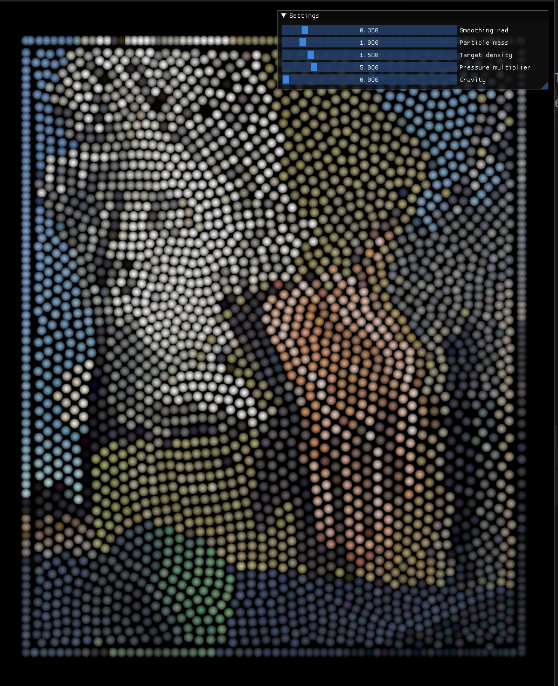

**This works only with Vulkan backend now**. It uses push constant in bitonic sort kernel, so no other APIs supported. Without the push_constants, we would need to submit the command buffer after every 'sort pairs' dispatch followed by constants buffer update. This takes to long  

Whole fluid sim is based on this video - https://youtu.be/rSKMYc1CQHE?si=zB9MEO3u5wMKoBBU   

Controls:
- Left mouse button - attract to pointer
- Right mouse button - push out of pointer
- MBM click - reset particle colors and 'attraction' positions
- Mouse wheel - 'attraction' speed

